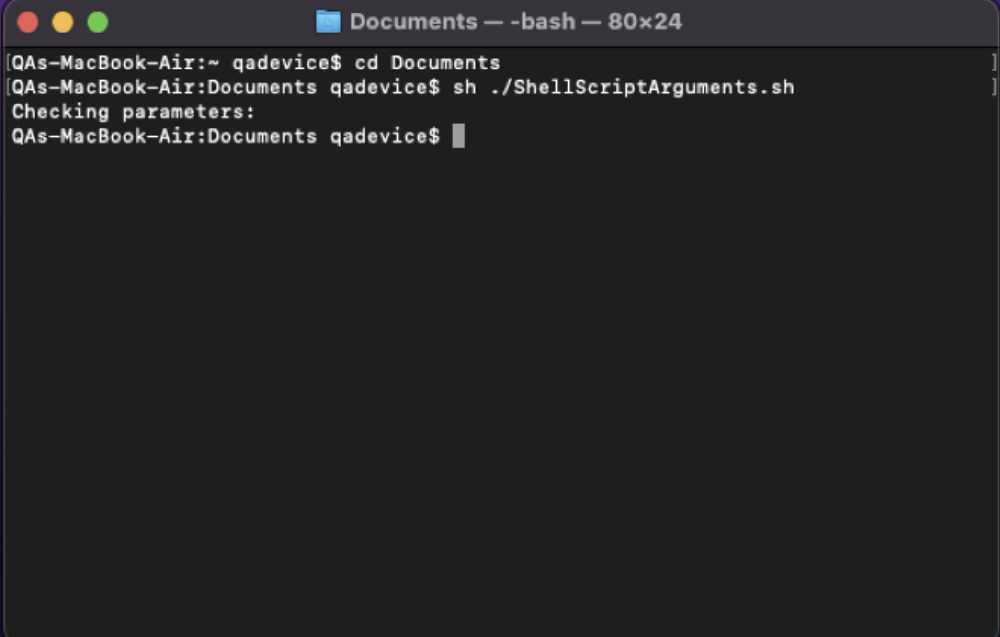
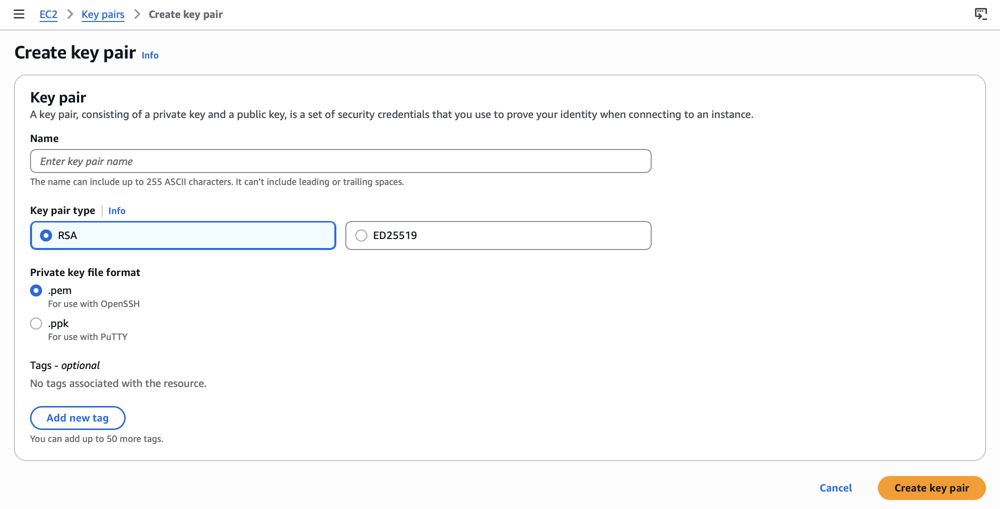
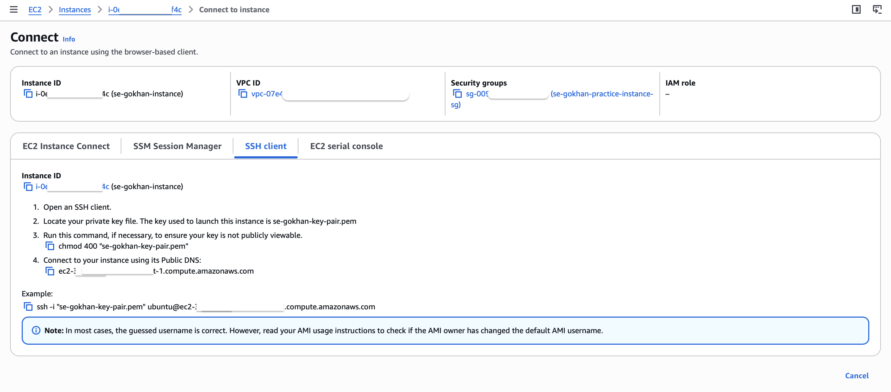
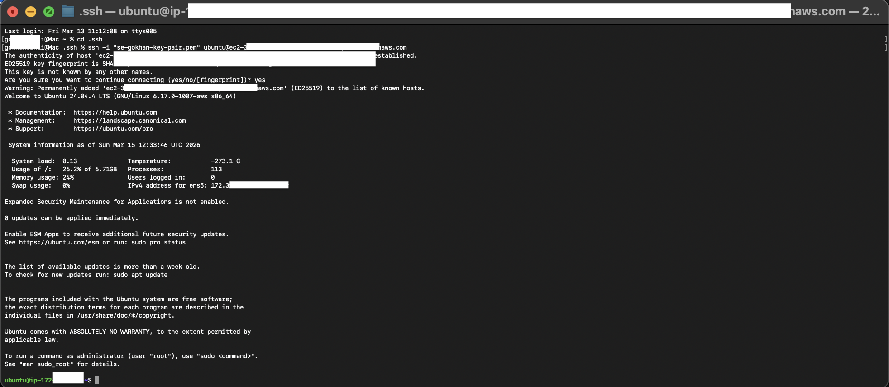

## AWS Practical

### The Shell



**Shell** = A text-based way to communicate with an operating system. Instead of clicking (GUI), you type commands directly. The GUI is actually just a layer that sends commands to the shell, which then communicates with the OS.

Types of shell:

- **Bash** (Born Again Shell) — the standard on Linux, also available on Windows via Git Bash
- **PowerShell / CMD** — Windows shells (different command syntax)
- **Terminal / ZSH** — Mac default shell (ZSH, which is similar to Bash)
- **CLI** = Command Line Interface — interchangeable term

### SSH = Secure Shell

SSH is a protocol for connecting to a remote computer's shell securely, **over the internet**. The connection is encrypted.

### SSH Key Pairs

SSH doesn't use username/password. It uses a **key pair**:

- **Public key** = the padlock. Stored on AWS and assigned to the EC2 instance.
- **Private key** = the physical key. Downloaded to your local machine. **Never share or expose this.**

They are mathematically linked — only the matching private key can unlock a given public key.

**Analogy:** You lock your EC2 instance with a padlock (public key). Only your specific key (private key) opens it. Wrong key = can't get in.

**Why .pem?** AWS adds a certificate to the private key file so they can detect if it gets exposed online. If you accidentally push a `.pem` to GitHub, AWS detects it within ~10–15 minutes, notifies you, and may fine you. **Never put your private key anywhere public. Never open or read its contents.**

---

### Step 1: Creating the SSH Key Pair (AWS Console)



1. Search for **EC2** in the AWS search bar → click the EC2 service
2. Left menu → **Network & Security** → **Key Pairs**
3. Click **Create Key Pair**
4. **Name:** `se-yourname-key-pair` (e.g. `se-gokhan-key-pair`)
5. **Key pair type:** RSA (leave default)
6. **Private key file format:** `.pem`
7. Click **Create Key Pair** → `.pem` file downloads automatically

AWS keeps the **public key**. You get the **private key**. You only create this once — reuse the same key pair for every instance.

After creating, move the `.pem` file from Downloads to `C:\Users\YourUsername\.ssh\`

**To see hidden folders in Windows (File Explorer):**
View → Show → Hidden Items (toggle on — one-off setting)

If `.ssh` doesn't exist, create it: New Folder → name it `.ssh` (dot is required — it makes it hidden).

Cut the `.pem` from Downloads, paste into `.ssh`.

---

### Git Bash – Basic Commands

**Git Bash** = an app that lets you run Linux/Bash commands.

| Command   | What it does                                             |
| --------- | -------------------------------------------------------- |
| `ls`      | List files and folders in current directory              |
| `ls -a`   | Show all files including hidden ones (starting with `.`) |
| `pwd`     | Print Working Directory — shows which folder you're in   |
| `cd .ssh` | Change directory into `.ssh` folder                      |
| `cd ..`   | Go up one level                                          |

---

### Setting Permissions on the Private Key

Run this once inside the `.ssh` folder:

```bash
chmod 400 "your-key-name.pem"
```

**`chmod` = change mode** (change file permissions). This is a Linux command that Git Bash can run on Windows.

**How Linux permissions work:**

Every file has 3 permission groups: **owner | group | public**. Each group can have: **read (4) | write (2) | execute (1)**. Add the numbers together for combinations.

| Number | Permissions            |
| ------ | ---------------------- |
| 7      | Read + Write + Execute |
| 6      | Read + Write           |
| 5      | Read + Execute         |
| 4      | Read only              |
| 0      | No permissions         |

`400` = owner can read only, group gets nothing, public gets nothing. Only you can read the private key. Nobody can modify it.

Common example: `755` = owner gets all (7), group and public get read + execute (5).

This command only needs to be run **once** per key pair.

---

### Step 2: Creating an EC2 Instance

**EC2 = Elastic Compute Cloud.** Virtual servers in the cloud.

- **"Instance"** = a virtual machine — a small virtualised computer running inside a much larger physical host server in an AWS data centre. You rent a slice of that host.
- An instance with 2 vCPUs and 1GB RAM shares a host server that might have thousands of CPUs.

**Steps:**

1. EC2 Console → **Launch Instance** (orange button)
2. **Name:** `SE-yourname-first-instance`
3. **AMI (Amazon Machine Image):** Quick Start → **Ubuntu** → Ubuntu Server 24.04 LTS
   - An AMI is a template — OS + any pre-installed software.
4. **Instance type:** `t3.micro` — 2 vCPUs, 1GB RAM. Small, efficient, free-tier eligible.
5. **Key pair:** Select the key pair you created (search your name in the dropdown)
6. **Network settings:** Click **Edit**
   - Set up your security group here (see below for more information)
   - Security group name: `SE-yourname-basic-sg`
   - Description: `SG that allows HTTP and SSH traffic`
   - Port range = 80
   - Source = 0.0.0.0/0
7. **Storage:** Leave default (8GB)
8. Check the **Summary** panel, then click **Launch Instance**

Once launched, click the instance ID link to view the **Instance Summary**:

- **Public IP** — how the internet reaches your instance
- **Private IP** — only accessible within the AWS network
- **Security tab** — verify your inbound rules (port 22 and port 80)

---

### Security Groups

A **security group** is a firewall for your EC2 instance.

**Defaults:**

- **Outbound:** ALL traffic is allowed by default — your instance can reach anything on the internet.
- **Inbound:** ALL traffic is BLOCKED by default — nothing can get in unless you create a rule.

**Inbound rules to set:**

| Type | Port | Source    | Purpose                                |
| ---- | ---- | --------- | -------------------------------------- |
| SSH  | 22   | 0.0.0.0/0 | Remote terminal access to the instance |
| HTTP | 80   | 0.0.0.0/0 | Web traffic (for NGINX and our app)    |

`0.0.0.0/0` = Everyone. Not ideal for production but fine for learning. We still have the SSH key pair as a security layer on top.

**Why HTTP not HTTPS?** HTTPS (port 443) requires an SSL certificate — too complex for basic. HTTP (port 80) is fine for testing.

**Ports:** Every piece of software that wants to communicate needs to run on a port. Think of a port like a room in your apartment. Lower port numbers (below ~1000) are reserved for common services: SSH = 22, HTTP = 80, HTTPS = 443, MongoDB = 27017.

---

### Step 3: Connecting to the EC2 Instance

From your Instance Summary page → click **Connect** → **SSH client** tab.



AWS gives you the exact command.

Open **Git Bash**, navigate into your `.ssh` folder, then run the commands step by step.



**Note:** The image is only an example of the connection steps. In this example, the chmod 400 command (step 3) is not executed because the permissions were already set earlier. If chmod 400 has already been run for the key file, it does not need to be executed again.

**First connection:** You'll see a prompt about the host fingerprint. Type `yes`. Your computer will save this host so it won't ask again.

Once connected, your terminal prompt changes to `ubuntu@ip-xxx-xxx` — you're now inside the EC2 instance running in AWS data centre.
