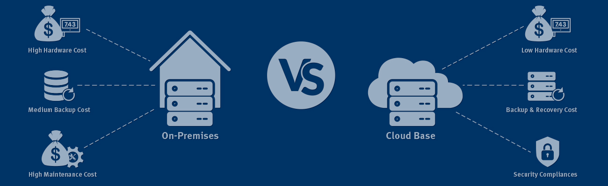

# Cloud Concepts

### On-Premises vs Cloud

### On-premises (on-prem)

The company buys and owns all servers, networking, storage, and cooling. Everything is the company's responsibility — buying hardware, hiring people to maintain it, paying for electricity. Full control and visibility, but expensive and slow to scale.

### Cloud Computing

> **On-demand delivery of computing resources and/or services over the internet.**

Key characteristics:

- **On-demand / pay-as-you-go** — only pay for what you use, for as long as you use it
- **Delivered** — the provider delivers it; you don't buy or set up hardware
- **Computing resources** — storage, processing power (CPU/RAM), networking
- **Services** — pre-built tools/platforms built on top of the hardware
- **Over the internet** — everything is accessed remotely via the internet

Additional points:

- Has a **GUI** (graphical interface) for managing resources
- Highly **customisable and flexible**
- **Portable** — accessible from anywhere with an internet connection
- The **cloud provider** maintains and updates the underlying network

## Cloud Deployment Models

### Simple Models

**Public Cloud — Shared Tenancy**

Multiple organisations share the same physical hardware (like apartments in the same building — private spaces, shared building). Managed by a third-party provider and accessed over the public internet.

Why companies prefer public cloud:

1. **Cost** — Economies of scale. AWS's scale means you pay less per unit than running your own servers. No hardware purchase, no cooling costs, no maintenance staff.
2. **More services** — AWS has 240–250+ services. Private cloud has far fewer.
3. **More expertise** — People certify in AWS/Azure/GCP. A bespoke private cloud means fewer people can hit the ground running.

**Private Cloud — Single Tenancy**

Hardware is exclusively for your organisation — no sharing. More secure from a data standpoint. But more expensive, fewer services, harder to hire for. You only go private cloud if you _have to_ (e.g. NHS patient records can't legally sit on shared US hardware).

Example: AWS GovCloud (US government only). EU Sovereign Cloud launched early 2026 — only accessible to EU government organisations.

### Complex Models

**Hybrid Cloud** — A mix of public and private, connected together.

- Common pattern: front-end app on public cloud (cost-efficient) + sensitive database on private cloud (regulatory requirement), connected up.
- More complex to manage than a single setup.

**Multi-Cloud** — Multiple public cloud providers used together.

- Different providers are better at different things.
- GCP has deliberately positioned itself as the de-facto "second choice" — it plays nicely with AWS and Azure for multi-cloud setups.
- The more providers you connect, the more complex it becomes.

---

## Cloud Service Types

The difference between service types is **who is responsible for what** — how much you manage vs how much the provider manages.

### IaaS — Infrastructure as a Service

The provider gives you the hardware and basic networking. **Everything else is your responsibility** — operating system, middleware, runtime/dependencies, your app, your data.

**Analogy:** You get an empty plot of land. You build the house yourself.

Most control, most responsibility, generally the cheapest when managed well.

Examples: AWS EC2, Azure Virtual Machines, Google Compute Engine.

### PaaS — Platform as a Service

The provider gives you the environment — OS, runtime, and dependencies are handled. **You write the code and provide the data.**

**Analogy:** You get a fully equipped kitchen. You just cook.

In the middle — less control, less responsibility than IaaS.

Examples: Google App Engine, AWS Elastic Beanstalk, Heroku.

### SaaS — Software as a Service

The entire product is managed by the provider. **You just access it via the browser and use it.**

**Analogy:** You go to a restaurant — no cooking, no ingredients, just sit down and eat.

Least control, least responsibility, highest cost per resource unit.

Examples: Gmail, Microsoft 365, Adobe Creative Cloud, Netflix, Dropbox, Salesforce.

### FaaS — Functions as a Service (bonus, good to know)

You provide a specific function and a trigger. The provider runs the function whenever the trigger fires — no need to reserve a whole server. You only pay per execution.

Example: AWS Lambda — e.g. "send an email every time 1,000 visitors hit your site."

---

## Advantages and Disadvantages of Cloud

**Advantages:**

- **Cost efficiency** — Pay-as-you-go (OPEX) vs buying hardware upfront (CAPEX). Very efficient _if managed properly_ — unmanaged cloud spending can spiral fast.
- **Accessibility / Portability** — Log in from anywhere in the world.
- **Performance** — Providers maintain infrastructure 24/7.
- **Physical security** — Data centres have multiple layers of security (biometrics, access controls, lasers). Far more secure than a shared server room.
- **Disaster recovery** — Backups and redundancy built in. Recovery is faster.
- **Faster deployment / going global** — Copying your setup to a new region (e.g. adding Seoul servers for Asia-Pacific users) is straightforward on cloud. Near-impossible with physical hardware.
- **Innovation and experimentation** — If something breaks, just terminate it and try again. No physical hardware to repair. Makes it easy to try new things and iterate — a core part of the DevOps mindset.

**Disadvantages:**

- Can be more expensive than on-prem if not managed carefully.
- Dependent on internet connectivity.
- Reduced visibility/control compared to on-prem.
- Shared tenancy (public cloud) is a security consideration for regulated data.

---

## Cloud Market Share

---

## Linux

### Why Linux for Servers?

~98% of web servers run Linux. Reasons:

- **Free** — No licensing fees, unlike Windows Server.
- **Open source** — You can view and modify the source code. More customisable.
- **Lightweight and efficient** — No GUI by default, so less processing overhead. Can run complex workloads on minimal hardware.
- **Flexible** — Everything is a package. Add or remove components as needed. Can even add a GUI if you want one.
- **Stable** — Does not force updates. A live website at 3am won't suddenly reboot for a system update. You choose when to update.
- **Secure** — Regularly updated. Version cycles move fast enough that by the time attackers crack one version, most systems are already several versions ahead.

### Ubuntu 24.04 LTS

**Ubuntu 24.04 LTS** is the most widely used Linux distribution. Well-documented, standard for cloud deployments, and supported by Canonical with long-term security patches.

---
