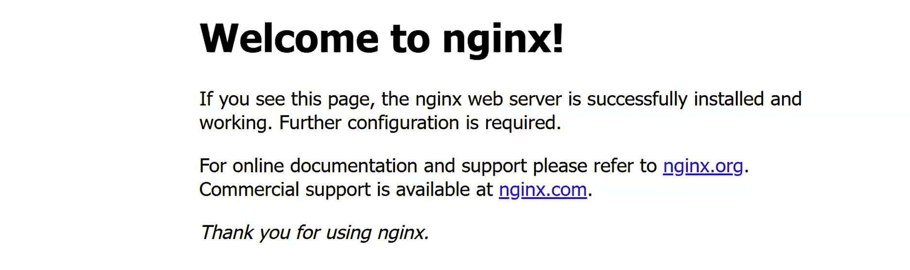
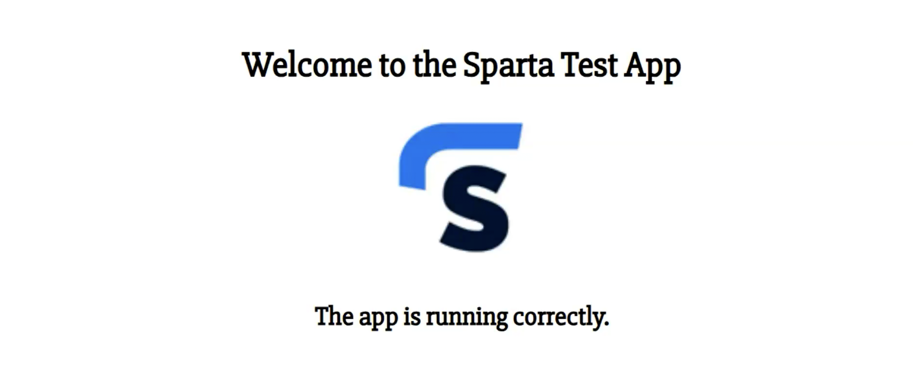

# Day 2 App Deployment Skill

## How to Terminate an EC2 Instance

> EC2 → select instance → **Instance State** → **Terminate Instance**

---

## Core Linux Commands

These are fundamental commands you'll use in every session:

| Command        | Purpose                                                       |
| -------------- | ------------------------------------------------------------- |
| `clear`        | Clear the terminal screen (output is lost — use for tidiness) |
| `whoami`       | Print the current logged-in user (`ubuntu` when inside EC2)   |
| `uname -a`     | Print kernel/OS information                                   |
| `date`         | Print the current date and time                               |
| `↑` (up arrow) | Recall the previous command from history                      |
| `pwd`          | Print working directory (which folder you are currently in)   |
| `ls`           | List files and folders in the current directory               |
| `cd <folder>`  | Change directory (navigate into a folder)                     |
| `cd`           | Navigate back to home directory                               |

---

## sudo apt update & upgrade

Every time you launch a fresh Ubuntu instance, the **first two commands you must run** are:

```bash
sudo apt update -y
sudo apt upgrade -y
```

Breaking these down:

### `sudo`

- Stands for **Super User Do** — runs a command with elevated (administrator-level) permissions.
- You are logged in as `ubuntu`, a standard user. Certain system-level operations require root/admin permissions.

### `apt`

- Stands for **Advanced Package Tool** — the package manager for Debian/Ubuntu Linux.
- Analogous to an app store. It knows where to download software from and how to install it.

### `sudo apt update -y`

- Goes to the package repositories (online lists of software) and **downloads the latest version information** for all installed packages.
- Does **not** install anything — it just updates the index. Safe to run at any time.

### `sudo apt upgrade -y`

- Takes the updated information from `apt update` and actually **installs the newer versions**.

### The `-y` flag

- Automatically answers "yes" to any prompts that apt would normally ask you to confirm.

---

## Installing and Running NGINX

**NGINX** is a lightweight, high-performance web server. It's one of the most popular in the world and is much easier to configure than Apache. When installed on Ubuntu, it starts automatically and listens on port 80.

```bash
sudo apt install nginx -y
```

After installation:

- Open the public IP of your instance in a browser (use **HTTP** not HTTPS).
- You should see the default **"Welcome to nginx!"** page.
- This confirms NGINX installed successfully and port 80 is open.



---

## systemctl — Managing Services

`systemctl` stands for **System Control**. It manages system services (background processes) on Linux.

| Command                        | Purpose                                               |
| ------------------------------ | ----------------------------------------------------- |
| `sudo systemctl status nginx`  | Check if the service is running (press **Q** to exit) |
| `sudo systemctl stop nginx`    | Stop the service                                      |
| `sudo systemctl start nginx`   | Start the service                                     |
| `sudo systemctl restart nginx` | Stop then start (use after making config changes)     |
| `sudo systemctl enable nginx`  | Make the service start automatically on OS boot       |

**Processes keep running after you disconnect via SSH.** Once NGINX is running, you can close your terminal and it stays alive.

---

## Scripting Introduction

A **script** is a single file containing a procedural set of commands that automates a specific job. It runs sequentially — line by line, top to bottom.

### Why use scripts?

- **Automation** — run many commands with a single command
- **Speed** — significantly faster than running commands one at a time
- **Reduces human error** — the same commands run the same way every time
- **Standardisation** — everyone on the team uses the same process and gets the same result
- **Collaboration** — can be shared, stored in version control, and reused

### Structure of a Bash script

```bash
#!/bin/bash
# This is a comment

sudo apt update -y
```

- **Line 1: Shebang** (`#!/bin/bash`) — tells the operating system which shell (interpreter) to use to run the file. **Every bash script must start with this line.**
- **Comments** — lines starting with `#` are ignored by the shell. Use them to explain what each section does.
- **File extension:** `.sh` (shell script)

### How to run a script

```bash
source scriptname.sh
```

### Example: NGINX install script

```bash
#!/bin/bash

# Update packages
sudo apt update -y

# Upgrade packages
sudo apt upgrade -y

# Install NGINX web server
sudo apt install nginx -y

# Restart NGINX
sudo systemctl restart nginx

# Enable NGINX as a startup process
sudo systemctl enable nginx
```

---

## SCP (Secure Copy)

SCP is used to copy files from your **local machine** to a remote EC2 instance over SSH.

```bash
scp -i "keyname.pem" /absolute/path/to/file ubuntu@<public-dns>:~/
```

---

## Sparta Node.js App Deployment

### Dependencies

Sparta Test App requires the following environment to run:

1. **Linux** (Ubuntu)
2. **Web server:** NGINX
3. **Node.js version 20.x** (not the latest — the app was written for v20)
4. **Port 3000 open** in the security group
5. **The app code itself**

### Security Group for the app

Your security group must have three ports open:

| Port | Protocol   | Purpose                          |
| ---- | ---------- | -------------------------------- |
| 22   | SSH        | Terminal access                  |
| 80   | HTTP       | Web browser access (NGINX)       |
| 3000 | Custom TCP | Node.js app (direct port access) |

### Installing Node.js v20 correctly

The default `sudo apt install nodejs` installs the latest available version, not v20. To get v20 specifically, use a **Personal Package Archive (PPA)**:

```bash
# Step 1: Download the v20 setup script from NodeSource
curl -fsSL https://deb.nodesource.com/setup_20.x | sudo -E bash -

# Step 2: Install Node.js (now v20 is the available version)
sudo apt install nodejs -y

# Verify
node -v    # Should output 20.x.x
```

### Getting app code via Git clone

Git is pre-installed on Ubuntu 24.04. You can clone a public GitHub repo without authentication:

```bash
git --version    # Confirm Git is available

git clone https://github.com/LSF970/se-sparta-test-app
```

### Running the app

```bash
cd SE-sparta-test-app/app

# Install Node libraries listed in package.json
sudo npm install

# Run the app (blocks the terminal — foreground process)
npm start app.js
```

- `npm` stands for **Node Package Manager** — analogous to `apt` for Node.js.
- `package.json` lists all the libraries (dependencies) the app requires. `npm install` reads this file and downloads them.
- The app runs on **port 3000**.
- While the app is running in the foreground, your terminal is "captured" — open a second terminal if you need to run other commands.
- Access NGINX: `http://<public-ip>` (port 80)
- Access the app: `http://<public-ip>:3000`


