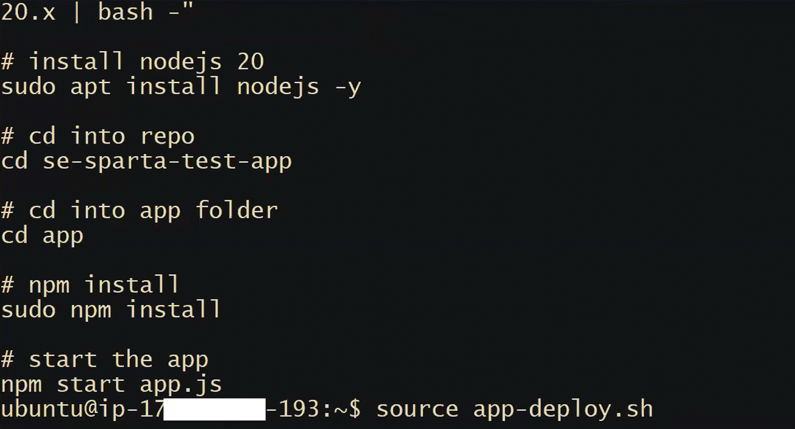
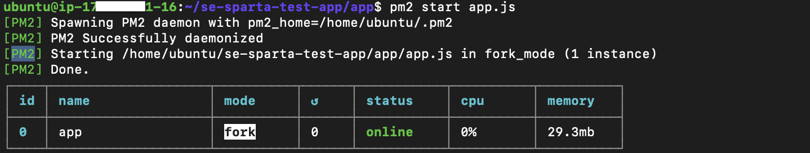

## App Deployment with the Deploy Script

### Running the Advanced Deploy Script

**Advanced deploy script** is available on the day-2 notes(full-app-deployment.sh). This script automates the entire app deployment:



```bash
source deploy-script.sh
```

The advanced script includes everything from the base script plus some improvements:

**What the advanced script does:**

1. `sudo apt update -y` and `sudo apt upgrade -y`
2. Installs NGINX
3. Installs Node.js v20 (via NodeSource PPA)
4. Clones the Sparta app from GitHub
5. Runs `npm install`
6. Installs and uses **pm2** to start the app

### pm2 — Process Manager



`pm2` is a **process manager for Node.js** that runs the app in the **background** (as a daemon), unlike `npm start` which blocks the terminal.

```bash
# Install pm2 globally
sudo npm install -g pm2

# Start the app in the background
pm2 start app.js

# Check running processes
pm2 list

# Stop the app
pm2 kill
```

**Why pm2 over `npm start`:**

- `npm start` blocks your terminal — you can't run any other commands.
- `pm2` runs the app in the background, freeing your terminal.
- pm2 can be configured to restart the app automatically if it crashes.

### NGINX Reverse Proxy (Preview — in the advanced script)

The advanced script also configures NGINX as a **reverse proxy**. Currently, users must go to `<ip>:3000` to access the app. With a reverse proxy, they go to `<ip>` (port 80) and NGINX forwards the request internally to port 3000.

The relevant NGINX config change (in `/etc/nginx/sites-available/default`):

```nginx
location / {
    proxy_pass http://localhost:3000;
    proxy_http_version 1.1;
    proxy_set_header Upgrade $http_upgrade;
    proxy_set_header Connection 'upgrade';
    proxy_set_header Host $host;
    proxy_cache_bypass $http_upgrade;
}
```

After making this change, restart NGINX:

```bash
sudo systemctl restart nginx
```

The app is now accessible at `http://<public-ip>` directly (no `:3000` needed).

---
