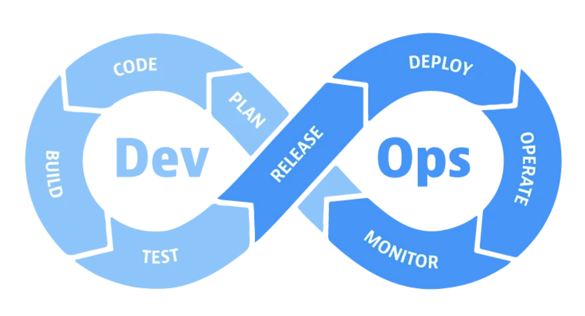

## DevOps Theory

### Where DevOps Came From

Historically, software companies had two separate teams:

- **Development (Dev)** — writes the code, builds new features.
- **Operations (Ops)** — deploys the code, keeps the servers running post-deployment.

These two teams frequently clashed. Developers would "throw code over the wall" to operations with no explanation. Operations would find problems, throw it back, and the cycle would repeat — a major bottleneck in the Software Development Lifecycle (SDLC).

**The original goal of DevOps** was to get someone _in between_ these two teams who understands both sides. Not just to communicate, but to **build systems** that make the handoff smoother, faster, and more automated.

### Modern DevOps — Breaking Down Silos

The concept proved so valuable that it expanded beyond just Dev and Ops. Modern DevOps is about making the _entire_ SDLC — including testing, data, business, and operations teams — work together more fluidly. The modern pitch for DevOps is:

> **Breaking down silos** — ensuring no team works in complete isolation. Code, files, and changes flow to the right place as quickly as possible with maximum visibility across the whole organisation.

### The DevOps Mindset — Iteration

Everything in DevOps is built on **iteration**:

1. **Get it working** (manual first — does it function?)
2. **Improve it** (add scripting, automation, better processes)
3. **Document/save it** (so others and your future self can follow)
4. **Repeat** — go back to step 1, improve again

### What DevOps Engineers Actually Focus On

When assessing any process in the SDLC, a DevOps engineer asks:

- **Speed** — Is this fast enough?
- **Stability** — Does it just work? Does it go down on its own?
- **Robustness** — Can it handle unexpected load or edge cases?
- **Standardisation** — Does everyone use the same environment and process? ("It works on my machine" is a symptom of poor standardisation.)
- **Documentation** — Can someone else pick this up when you're on holiday?
- **Visibility** — Can the team see what's happening in real time?
- **Versioning** — Can you revert to a previous state if an improvement breaks things?
- **Monitoring/Metrics** — How do you know when something goes wrong?

### Headline DevOps Systems

These are the core systems DevOps engineers are expected to build and maintain:

#### CICD (Continuous Integration / Continuous Deployment)

This is the "main event" — the most sought-after skill in DevOps job listings.

**Continuous Integration (CI):** Automates the process of multiple developers merging their code changes into the shared main codebase. Instead of a manual code review every time, automated tests run and the merge happens automatically if they pass.

**Continuous Delivery (CD — Delivery):** Automates sending the new, tested code to the correct servers.

**Continuous Deployment (CD — Deployment):** Automates _switching over_ to the new code so end users see the changes immediately.

> **Example:** Online games used to release massive updates every few months. Now they release small patches daily. That's only possible with a CICD pipeline — a human couldn't test and deploy that many changes fast enough.

#### Other headline systems

- **Infrastructure as Code (IaC)** — e.g. Terraform
- **Containers** — e.g. Docker, Kubernetes

### DevOps Toolkit — Two Levels

**Level 1 — Core skills (foundation):**

- Version control (Git/GitHub)
- Documentation (Markdown)
- Shell/CLI (Bash)
- Programming knowledge (Python scripting focus)

**Level 2 — DevOps tools:**

- Cloud computing (AWS/Azure/GCP)
- Scripting
- Linux
- CICD
- Infrastructure as Code
- Containers

### Scripting Languages for DevOps

DevOps engineers write **scripts**, not programs. A script is a single file that does one specific job, the same way every time.

- **Bash** — commands, simple automation
- **Python** — most popular choice for more complex logic; huge library ecosystem
- **Go (Golang)** — also used
- **Groovy** — used with Jenkins (a CICD tool)

---
