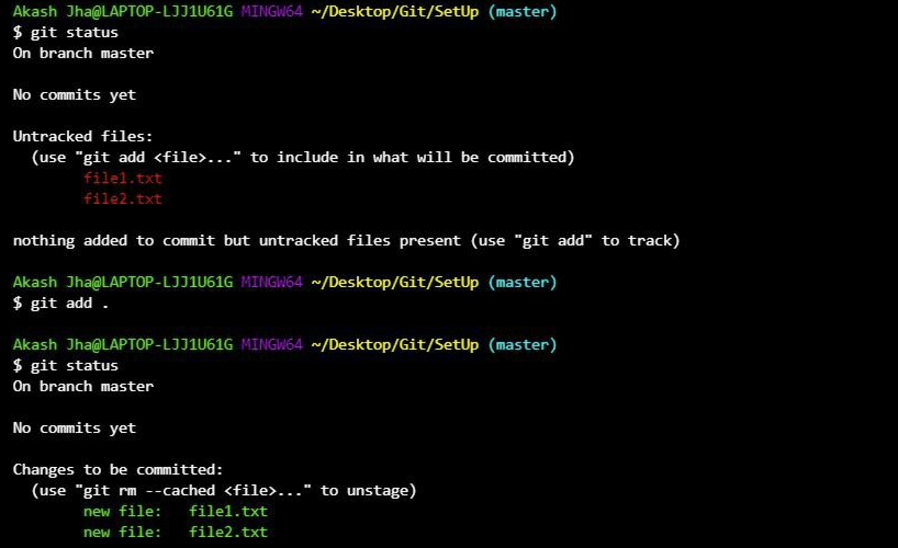
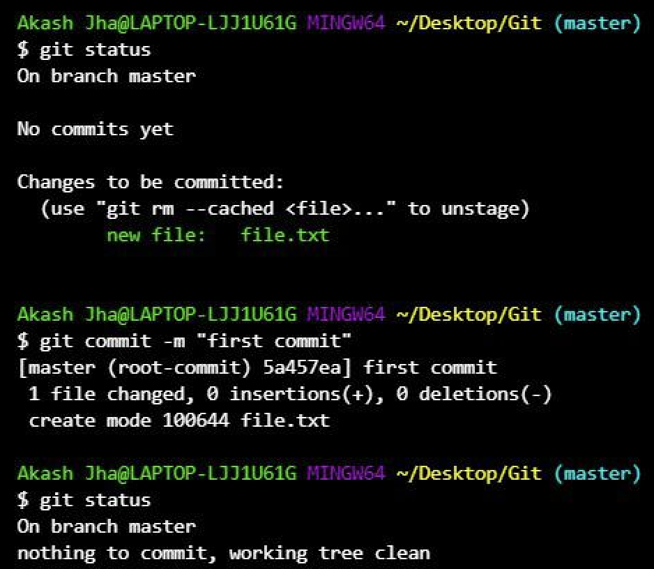

## Git - Version Control


### What is Version Control?

The **core concept** of version control has nothing to do with computers. It's the idea of having multiple separate versions of something so you can go back if something goes wrong. You've done manual version control if you ever saved `essay_v1.docx`, `essay_v2.docx`, etc.

**Git** is software that does this efficiently. Rather than saving entire copies of every file for every version, Git only records _what changed_ between versions.

> **Analogy:** A family photo album. Instead of reprinting the entire album every year, you just swap out Dad's photo now that he has a haircut. Everything else stays the same. That's how Git tracks changes — it only stores what's different.

### Git Key Terminology

| Term               | Meaning                                                                   |
| ------------------ | ------------------------------------------------------------------------- |
| **Commit**         | A snapshot/version — think of it as pressing "save" on your project state |
| **Tracked**        | Git is aware this file exists and has changed compared to the last commit |
| **Added / Staged** | The file is queued to be included in the next commit                      |
| **Committed**      | The snapshot has been taken and saved                                     |

### The Three Stages of a File in Git

```
File changed → Tracked (Git notices) → Added/Staged (queued) → Committed (snapshot taken)
```

You don't have to include every changed file in every commit. The staging area lets you pick and choose what goes into the next version — like choosing which photos to swap out in the album.

### Setting Up Git (one-time, run before your first commit)

```bash
git config --global user.name "Your Name"
git config --global user.email youremail@example.com
```

### Core Git Commands

```bash
# Initialise a new Git repository in the current folder
git init

# Check the status of your files (green = staged, red = not staged)
git status

# Stage a specific file
git add <filename>

# Stage everything in the current folder
git add .

# Take a snapshot (commit) with a message
git commit -m "first commit"

# View commit history
git log
```




---
