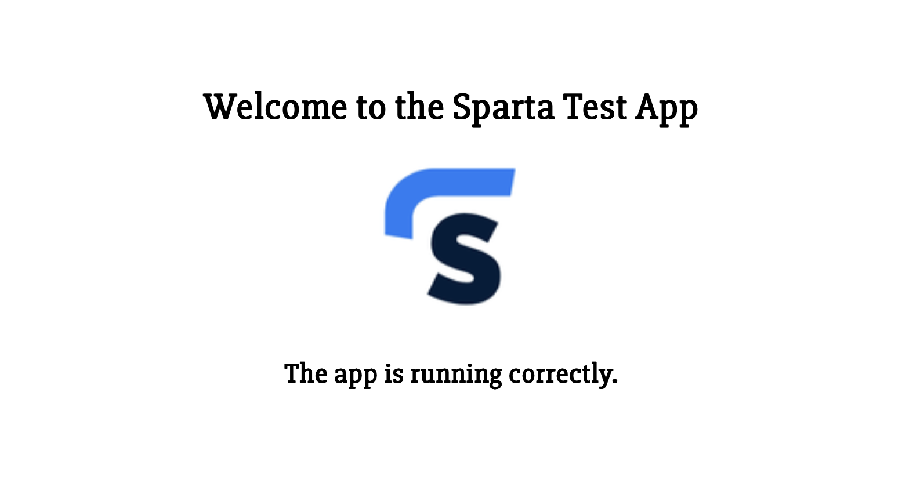

# Sparta App Deployment guide

### Step 1: Setting up

1. Log in to AWS console with correct username and password
2. Navigate to the "EC2" service
3. Click the "Launch Instance" button

### Step 2: Create EC2 Instance

Fill out the presented form with the following values:

1. Name = "se-yourname-node20-sparta-app"
2. AMI = "Ubuntu 24.04 LTS"
3. Instance type = "t3.micro"
4. Key Pair = "se-your-key-pair.pem"
5. Network settings
   1. VPC = Default
   2. Subnet = Default
   3. Enable Public IP adress = Enabled
   4. Security Group must have:
      1. Port 22 open (SSH)
      2. Port 80 open (HTTP)
      3. Port 3000 (Sparta App)
6. Configure Storage = 8 GIB
7. Advanced Details = None
8. When done and reviewed click "Launch Instance".

### Log in and run deploy script

1. Open "instance summary" page
   1. Should look like a link
2. Click the "Connect" button
3. At the bottom of the connect page, copy the example SSH command provided
4. Open GitBash session
5. `cd` into your `.ssh` folder
6. Run the copied command to log in via SSH
   1. Make sure to type "yes" when prompted
7. Copy the contents of the following bash script:

```bash
#!/bin/bash

# update packages
sudo apt update -y

# upgrade packages
sudo apt upgrade -y

# install git if it's not there
sudo apt install git -y

# get the app code
git clone https://github.com/LSF970/se-sparta-test-app.git

# install nginx

sudo apt install nginx -y

# restart nginx
sudo systemctl restart nginx

# enable --> makes the process a startup process
sudo systemctl enable nginx

# install curl
sudo apt install curl -y

# download nodejs 20.x
sudo bash -c "curl -fsSL https://deb.nodesource.com/setup_20.x | bash -"

# install nodejs 20
sudo apt install nodejs -y

# cd into repo
cd se-sparta-test-app

# cd into app folder
cd app

# npm install
sudo npm install

# start the app
npm start app.js
```

8. Create a new file in your EC2 instance using:
   1. `Sudo nano app-deploy.sh`
9. Paste the script contents into this file
10. Save and close the file
    1. `Ctrl + x` to exit
    2. `y` to save
    3. `Enter` to overwrite current contents
11. Now run the script with the command:
    1. `source app-deploy.sh`
12. Wait for the script to finish running
13. If it is successful you should see the message:
    1. "Your app is ready and listening on port 3000"
14. Check your EC2 instance public IP with `:3000` on the end. You should see the Sparta App Homepage.


