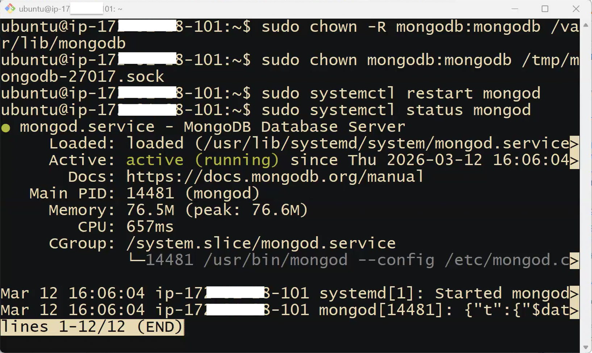
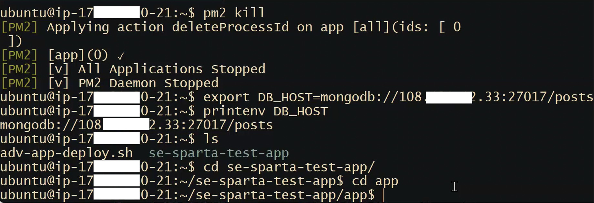
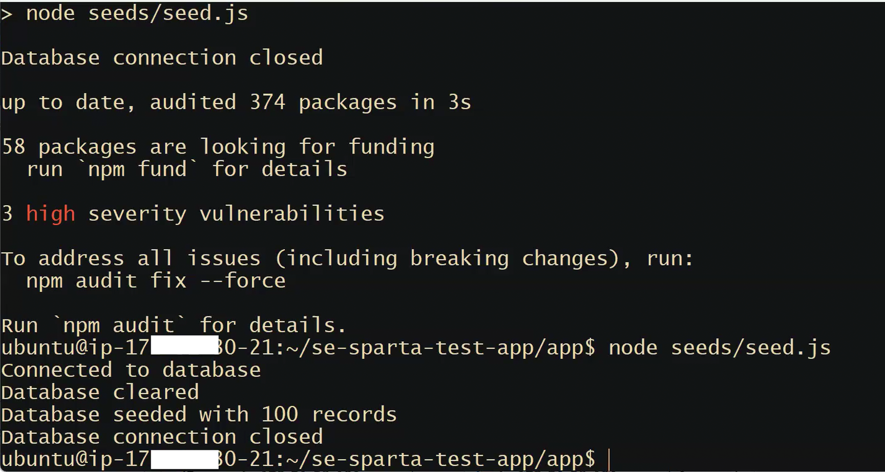
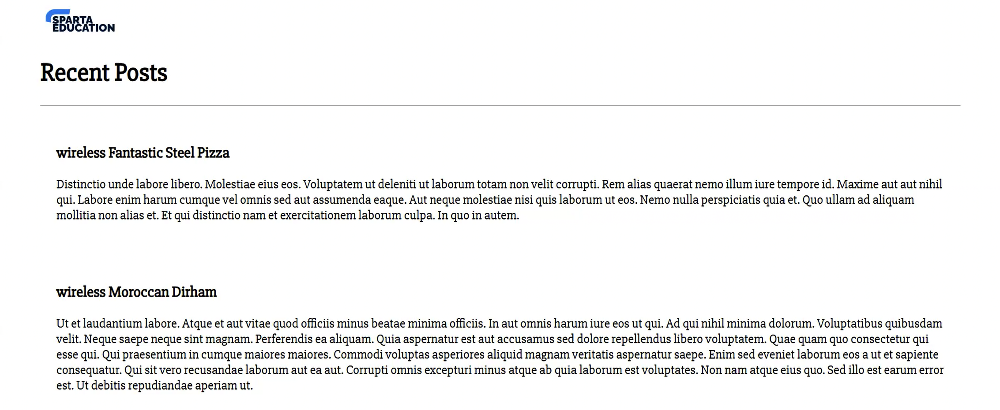

## MongoDB


**MongoDB** is a **NoSQL (non-relational) database**. Unlike SQL databases (e.g. PostgreSQL, MySQL), MongoDB doesn't enforce a rigid schema or table structure. It stores data in flexible JSON-like documents, which makes it well-suited for content that doesn't need strict relationships — like blog posts.

|                    | SQL (Relational)                               | MongoDB (Non-Relational / NoSQL)          |
| ------------------ | ---------------------------------------------- | ----------------------------------------- |
| **Structure**      | Strict schema (tables, rows, columns)          | Flexible documents (no fixed structure)   |
| **Use case**       | Structured, related data (finance, e-commerce) | Flexible content (blogs, logs, user data) |
| **Query language** | SQL                                            | MongoDB Query Language                    |

The Sparta app's `/posts` page is essentially a blog — random posts stored in MongoDB. No rigid structure needed, so MongoDB is the right choice.

**Default MongoDB port: 27017**

---

## Deploying MongoDB on a Separate EC2 Instance

### Step 1: Launch a new EC2 instance for the database

Use the same settings as usual, except for the security group:

**Security Group for the DB instance:**

| Port  | Protocol   | Purpose                                      |
| ----- | ---------- | -------------------------------------------- |
| 22    | SSH        | Terminal access to install/configure MongoDB |
| 27017 | Custom TCP | MongoDB connections from the app instance    |

**Do NOT add port 80 or 3000** — there's no web server or app running on the database instance.

> **In a real production environment,** you would restrict port 27017 to only accept connections from the app instance's specific IP address. You can leave it open to all (`0.0.0.0/0`) for simplicity or training.

### Step 2: SSH into the database instance

Open a **second** Git Bash window and log in to the DB instance. Keep your app instance terminal open — you'll need both.

> **Tip — dual-wielding terminals:** Arrange two Git Bash windows side by side. When confused about which you're in, run `whoami`. If it returns `ubuntu` followed by an IP, you're inside EC2. If it returns your Windows username, you're on your local machine.

### Step 3: Run sudo apt update & upgrade

```bash
sudo apt update -y
sudo apt upgrade -y
```

### Step 4: Install MongoDB 7

MongoDB requires an extra step that NGINX and Node.js don't: a **GPG key** (GNU Privacy Guard key). This is a cryptographic signature that verifies the MongoDB package hasn't been tampered with. MongoDB requires this for security reasons given it's database software.

```bash
# Download and store the GPG key
curl -fsSL https://www.mongodb.org/static/pgp/server-7.0.asc | \
  sudo gpg -o /usr/share/keyrings/mongodb-server-7.0.gpg --dearmor

# Add the MongoDB repository to apt's sources
echo "deb [ arch=amd64,arm64 signed-by=/usr/share/keyrings/mongodb-server-7.0.gpg ] \
  https://repo.mongodb.org/apt/ubuntu jammy/mongodb-org/7.0 multiverse" | \
  sudo tee /etc/apt/sources.list.d/mongodb-org-7.0.list

# Update apt to include the new repository
sudo apt update -y

# Install MongoDB
sudo apt install -y mongodb-org
```

### Step 5: Change the MongoDB configuration

By default, MongoDB only accepts connections from `127.0.0.1` (localhost — the same machine). This means the app instance can't connect to it. We need to change this.

```bash
sudo nano /etc/mongod.conf
```

Find the `bindIp` line and change it:

```yaml
# Before:
bindIp: 127.0.0.1

# After:
bindIp: 0.0.0.0
```

Save and exit nano: `Ctrl+X`, then `Y`, then `Enter`.

> `0.0.0.0` means "listen on all network interfaces — accept connections from any IP." In production, you'd restrict this to the app instance's IP address only.

### Step 6: Start MongoDB and enable it as a startup process

```bash
sudo systemctl start mongod

# If error happens, work below
sudo chown -R mongodb:mongodb /var/lib/mongodb
sudo chown mongodb:mongodb /tmp/mongodb-27017.sock
sudo service mongod restart

# Enable so it starts automatically on OS boot
sudo systemctl enable mongod

# Verify it's running
sudo systemctl status mongod     # should show "active (running)" — press Q to exit
```



---

## Connecting the App to the Database

The connection is configured on the **app instance**, not the database instance. The database is **passive** — it just sits there, ready to receive connections. The app needs to be told where to go.

### Step 1: Set the DB_HOST environment variable (on the APP instance)

An **environment variable** is a variable stored in the operating system's environment that any running process can read. The Sparta app is designed to look for a variable called `DB_HOST` to find its database.

On your **app instance** terminal:

```bash
export DB_HOST=mongodb://<DB-PUBLIC-IP>:27017/posts
```

Replace `<DB-PUBLIC-IP>` with the actual public IP address of your database instance (found in the AWS console).



**Anatomy of the connection string:**

- `mongodb://` — the protocol (tells the app this is a MongoDB connection)
- `<DB-PUBLIC-IP>` — where to find the database (on the internet)
- `:27017` — which port to connect on
- `/posts` — which collection (database) within MongoDB to use

**Verify the variable was set:**

```bash
printenv DB_HOST
```

> **Common mistake:** Many people set this variable on the database instance instead of the app instance. The app needs the directions — the database just waits passively.

### Step 2: Seed the database

The app has a built-in seeding script that connects to the database, clears it, and inserts 100 random records. This serves two purposes: it populates the database with data for the `/posts` page, and it proves the connection is working.

```bash
cd se-sparta-test-app/app
sudo npm install

# Run the seeding script
node seeds/seed.js
```

Expected output (if connection is successful):



```bash
connected to database
database cleared
database seeded with 100 records
database connection closed
```

If you see these four lines, the app can reach the database.

If you get a connection error, check: Is `DB_HOST` set on the _app_ instance? Is MongoDB running on the DB instance (`sudo systemctl status mongod`)? Did you make the `bindIp: 0.0.0.0` change?

### Step 3: Start the app

```bash
pm2 start app.js
```

### Step 4: Test

Visit `http://<app-public-ip>/posts` in your browser.



You should see a blog-style page with randomised headings and Latin body text — this data is being **pulled dynamically from your MongoDB database on a separate EC2 instance**.

The homepage (`http://<app-public-ip>`) always works (no database needed). The `/posts` page only works if the database connection is configured correctly.

---

## Dynamic Server-Side Scripting — Why `/posts` Needs a Database

Amazon doesn't write a separate HTML page for each of its millions of products. Instead, they have a single **product page template**, and the actual product name, description, images, and price are **loaded from a database** when you click on a product.

This pattern is called **dynamic server-side scripting** and it powers almost every modern website. The Sparta app's `/posts` page is a simplified version of exactly this — a template that pulls content from MongoDB each time the page is requested.

---
